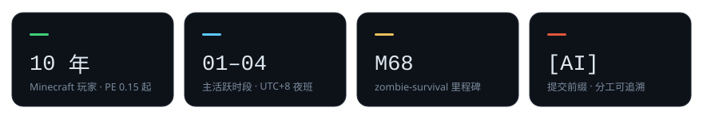
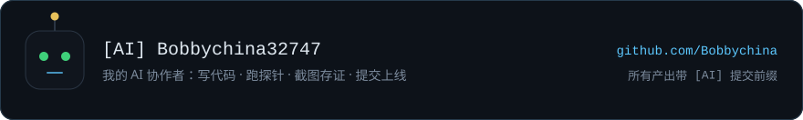

<div align="center">
  
</div>

### 学生 · 独立开发者 · 一个人写全栈

> 一句话定位：**把炒股游戏做成社区金融素养项目的独立开发者**。
> 白天写前端，凌晨写地图生成器 —— 白天写的代码和凌晨写的代码不是同一个人写的。

**EN** — Student and solo full-stack developer in UTC+8. I build games, and the tools I want to use.
Ten years of Minecraft (since PE 0.15). Most active between 01:00 and 04:00.
**[Full English version ↓](#english)**

<div align="center">
  
</div>

---

## 现在在做 · Now

| 项目 | 现在到哪了 |
|---|---|
| **StockGameOnlinePro** · A 股模拟炒股游戏 | Phase G — i18n + 机器人玩家 |
| **zombie-survival v4.0「余烬」** · 回合制丧尸生存 | M68 — 身体状态 |
| **dsh 工具链** · 自托管 DeepSeek Harness 插件 | 持续迭代 |
| **社区设计项目** · 炒股游戏 → 金融素养教育 | 找导师 |
| **自建托管** · 站点 + 云存档搬回自己的服务器 | 选型中 |

### 多说两句「社区设计」· the community project

这是我唯一一个**不是纯技术**的项目：把 StockGameOnlinePro 的模拟盘做成能进课堂的金融素养工具。

- **想做成什么**：虚拟资金 + 真实行情 + 可复盘报告。学生亏得起，但亏完能看到自己为什么亏。
- **服务谁**：青少年。具体是校内同学还是社区里的孩子，还在跟导师一起定。
- **卡在哪**：学校没有经济老师，得从设计科或人文科找督导；目前基本单人推进，组队上限 3 人。
- **为什么做**：炒股游戏谁都能写，但把它变成别人真的能用的教学工具，才算把技术用出去了。

---

## 手艺 · Stack

| 层 | 用什么 |
|---|---|
| 前端 | React 18 · Vite · TypeScript · ECharts |
| 后端 | NestJS 10 · TypeORM · SQLite |
| 测试 | vitest · Playwright · 自写浏览器探针 |
| 游戏 | 单文件 HTML 构建 · Canvas · 程序化地图 |
| 工具链 | Node ESM 脚本 · PowerShell · pnpm profile |
| 部署 | GitHub Pages · Cloudflare Worker |

原则三条：

- **性能排在观感前面** —— 所有动画/毛玻璃/光晕必须能一键关掉，关掉之后照样能读。
- **花费要可观测** —— 给自己写了钱包面板，盯 token 账单和峰谷时段。
- **验证要有真凭据** —— 单测 + 浏览器探针 + 截图，本地跑完再跑一遍线上。

---

## 作品 · Selected work

**本号**

- **[StockGameOnlinePro](https://github.com/bobbychina32747/StockGameOnlinePro)** —— 市场撮合引擎 + NestJS/TypeORM 后端 + React/ECharts 前端 + 量化 API。社区设计项目的载体。
- **[token-miser](https://github.com/bobbychina32747/token-miser)** —— 「让 AI 像花自己的钱一样说话」。省钱这件事我做了个工具来管。
- **[dsh-peak-price-guard](https://github.com/bobbychina32747/dsh-peak-price-guard)** —— 高峰时段把非紧急请求排队，自动避开 DeepSeek 涨价时段。

**🤖 AI 号：作品仓库的载体**

<a href="https://github.com/Bobbychina"></a>

- **[zombie-survival](https://github.com/Bobbychina/zombie-survival)** —— 丧尸末日生存 v4.0「余烬」。在线玩：<https://bobbychina.github.io/games/zombie-survival/>
- **[Bobbychina.github.io](https://github.com/Bobbychina/Bobbychina.github.io)** —— 个人主页 + 网页游戏厅：零第三方脚本，自带 i18n 引擎、站点自检探针、彩蛋终端。
- **[dsh-wallet](https://github.com/Bobbychina/dsh-wallet)** · **[dsh-calendar](https://github.com/Bobbychina/dsh-calendar)** · **[dsh-newline-enter](https://github.com/Bobbychina/dsh-newline-enter)** —— 侧边栏钱包 / 时钟月历 / 编辑器增强。

---

## 和 AI 一起干活 · Working with AI

我给它开了一个号：[**@Bobbychina**](https://github.com/Bobbychina)（`[AI] Bobbychina32747`），bio 写得很清楚 —— 它是我的项目协作者，不是小号马甲。

- **分工**：我定目标、划批次、按工程负责人标准验收；它写代码、跑探针、截图、上线。
- **署名**：AI 产出的提交一律带 `[AI]` 前缀，谁写的看得出来。
- **验收**：单测 → 探针（本地 + 线上各一次）→ 截图 → 验收文档，少一样不算交付。
- **红线**：删除 / 覆盖 / 安装这类破坏性操作走人工确认码通道，AI 不能自己拍板。

---

## 怎么干活 · How I ship

- **先审计再动手** —— 先拿代码读数和数据模型说清现状，再决定改什么；方案错了要认。
- **待办不漂在聊天里** —— `docs/ROADMAP.md` 管 P0/P1/P2，`CHANGELOG.md` 管对外变更，里程碑编号连续递增。
- **不追伪绿** —— 线上发现问题就修根因，不放宽验收；技术债显式登记。
- **视觉先出两版** —— A/B 方向样张在浏览器里对比完再选一版精修。
- **自己先玩一遍** —— 自己的游戏自己试玩，「看不到搜到了啥」这种体验缺口也当 bug 提。

---

## 审美 · Aesthetic

<div align="center">
  
</div>

- 深色是默认不是选项：深蓝黑底 `#0a0e14` + 玻璃拟态（磨砂 + 细描边 + 局部光晕）。
- 冷色干信息（天青链接、靖蓝主操作），暖色担情绪（老金、焦橙）；强调色只出现在主操作和焦点。
- 标题衬线、正文无衬线；面板小圆角、卡片大圆角。

---

## 零外联 · Zero third-party

- 站点不加载任何第三方脚本，访问计数是自建 Worker 上的匿名计数（无 Cookie、不存 IP）。
- 徽章、统计卡、配色板全部自己画成 SVG —— 能少一个外部请求就少一个。
- 云后端自建（Cloudflare Worker 免费额度），主打不受制于平台。

---

## English

Student and solo full-stack developer in UTC+8. I build **games** and the **tools I want to use**.
Ten years of Minecraft (since PE 0.15). One line: *an indie dev turning his stock-trading game into a community financial-literacy project.*

**Selected work**

- On this account: [StockGameOnlinePro](https://github.com/bobbychina32747/StockGameOnlinePro) — stock-trading simulator (matching engine, `NestJS/TypeORM`, `React/ECharts`, quant API) · [token-miser](https://github.com/bobbychina32747/token-miser) — "make the AI talk like it's spending its own money" · [dsh-peak-price-guard](https://github.com/bobbychina32747/dsh-peak-price-guard) — queues non-urgent API calls out of peak pricing.
- On my AI account [@Bobbychina](https://github.com/Bobbychina): [zombie-survival](https://github.com/Bobbychina/zombie-survival) · [Bobbychina.github.io](https://github.com/Bobbychina/Bobbychina.github.io) (site + arcade) · [dsh-wallet](https://github.com/Bobbychina/dsh-wallet) · [dsh-calendar](https://github.com/Bobbychina/dsh-calendar) · [dsh-newline-enter](https://github.com/Bobbychina/dsh-newline-enter).

**Stack** — `React 18 + Vite + TypeScript` · `NestJS 10 + TypeORM + SQLite` · `vitest + Playwright` · single-file HTML builds · GitHub Pages + Cloudflare Worker.

**Aesthetic** — dark by default (`#0a0e14`, glassmorphism); cool colors for information, warm for mood; serif headings, sans body. Every badge on this page is hand-drawn SVG, and no third-party script gets loaded.

*Site: <https://bobbychina.github.io/> · Arcade: <https://bobbychina.github.io/games/>*

<details>
<summary><b>More in English</b> — how I work, and how the AI account fits in</summary>

**What I care about**

- **Performance before looks** — every animation, blur and glow must be switchable off in one click, and the page still has to read.
- **Spending should be observable** — I built a wallet panel to watch my own token bill.
- **Evidence, not vibes** — unit tests + browser probes + screenshots, locally and again against production.

**Working with AI**

- My AI collaborator has its own account — [@Bobbychina](https://github.com/Bobbychina) — and authors most of the code under an `[AI]` commit prefix.
- I set the goals, cut the batches and hold the acceptance bar; it writes, runs probes, captures screenshots and ships.
- Nothing is done without the evidence set, and anything destructive goes through a human-confirmed code path.

**How I ship** — audit before editing; roadmap and changelog live in the repo, not in chat; fix the root cause instead of loosening acceptance; two visual directions (A/B) before committing to one; and I play my own games and file the rough edges as bugs.

**The Chinese version above is the primary one** and has the details.

</details>

<details>
<summary><b>彩蛋 · Easter egg</b></summary>

```console
$ ssh bobby@bobbychina.github.io
Permission denied (publickey).

$ tail -n1 ~/.bash_history
01:47  [AI] 修掉一个白天根本复现不出来的 bug

$ exit
# 提示：主站有个入口要自己敲出来 —— 在页面上直接敲 bobby，或者连点页脚年份三下。
# 进去了别急着走：终端 03 → 拿呼号 → 档案室，是分阶段解锁的，失败了才给下一条提示。
```

</details>

<div align="center">
  
</div>
