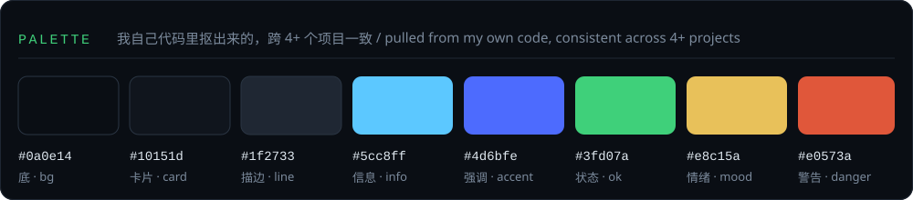

<div align="center">
  
</div>

学生 + 独立开发者，一个人写全栈。做游戏的时候顺手把工具链造了，造工具的时候顺手把游戏改了。

- **从哪来**：10 年 Minecraft 玩家（PE 0.15 起）。做体素沙盒、程序化地图、地形生成，都是当年挖矿挖出来的执念。
- **写什么**：TypeScript 为主 —— 前端 `React 18 + Vite`，后端 `NestJS + TypeORM + SQLite`，测试 `vitest + Playwright`，能纯静态就纯静态（单文件 HTML，零依赖）。
- **在哪活跃**：UTC+8，主时段 **01:00–04:00**。白天写的代码和凌晨写的代码不是同一个人写的。
- **在意什么**：性能排在观感前面（所有特效必须能一键关掉）、花费可观测（给自己写钱包面板盯 token 账单）、验证要有真凭据（单测 + 浏览器探针 + 截图，本地跑完再跑一遍线上）。
- **站点**：<https://bobbychina.github.io/> · 游戏厅 <https://bobbychina.github.io/games/>

---

## 现在在做 · Now

| 在做的事 | 状态 |
|---|---|
| **StockGameOnlinePro** —— A 股模拟炒股游戏：撮合引擎 + NestJS/TypeORM 后端 + React/ECharts 前端 + 量化 API，CN/HK/US 三市场、机器人玩家 | Phase G（i18n + 机器人玩家） |
| **zombie-survival v4.0「余烬」** —— 回合制丧尸生存网页游戏，24×24 大地图、程序化分区、建筑内部平面图；硬核化方向是「不追数值难度，追计划失败的代价」 | 里程碑推进到 M68 |
| **dsh 工具链** —— 自己维护一整套 DeepSeek Harness 插件（省钱守卫 / 钱包 / 日历 / 换行 / 性能模式），顺手删掉和官方重复的 | 持续迭代 |
| **社区设计项目** —— 拿自己的炒股游戏做金融素养教育，服务真实社区 | 找导师 + 定方案 |
| **自建托管** —— 计划买服务器 + 域名，把站点和云存档后端从第三方平台搬回自己手里 | 选型中 |

## 手艺 · Stack

| 层 | 用什么 | 备注 |
|---|---|---|
| 前端 | React 18 · Vite · TypeScript · ECharts | 状态重的界面会把逻辑抽出来单独测 |
| 后端 | NestJS 10 · TypeORM · SQLite | 交易系统级别的接口形状与幂等键 |
| 测试 | vitest · Playwright · 自写浏览器探针 | 探针要本地和线上各跑一次 |
| 游戏 | 单文件 HTML 构建 · Canvas · 程序化地图 | 能零依赖就零依赖 |
| 工具链 | Node ESM 脚本 · PowerShell · pnpm profile | 自己写的脚本比装依赖便宜 |
| 部署 | GitHub Pages · Cloudflare Worker | 自建计数，无 Cookie、不存 IP |

## 作品 · Selected work

**本号（主号）**
- **[StockGameOnlinePro](https://github.com/bobbychina32747/StockGameOnlinePro)** —— A 股模拟炒股游戏：市场引擎 + NestJS/TypeORM 后端 + React/ECharts 前端 + 量化 API。也是我「社区设计」项目的载体。
- **[token-miser](https://github.com/bobbychina32747/token-miser)** —— 「让 AI 像花自己的钱一样说话」。**省钱这件事我做了个工具来管。**
- **[dsh-peak-price-guard](https://github.com/bobbychina32747/dsh-peak-price-guard)** —— DeepSeek API 峰谷定价守卫：高峰期把非紧急请求排队/延后，自动避开涨价时段。

**作品仓库挂在我给 AI 开的号上**（见下一节）
- **[zombie-survival](https://github.com/Bobbychina/zombie-survival)** —— 丧尸末日生存 v4.0「余烬」，纯静态单文件构建，存档加密。在线玩：<https://bobbychina.github.io/games/zombie-survival/>
- **[Bobbychina.github.io](https://github.com/Bobbychina/Bobbychina.github.io)** —— 个人主页 + 网页游戏厅：纯静态零第三方脚本，自带 i18n 引擎、站点自检探针、彩蛋终端；游戏厅有「共创」板块收录朋友的作品。
- **[dsh-wallet](https://github.com/Bobbychina/dsh-wallet)** · **[dsh-calendar](https://github.com/Bobbychina/dsh-calendar)** · **[dsh-newline-enter](https://github.com/Bobbychina/dsh-newline-enter)** —— 侧边栏钱包（余额 / 峰谷倒计时 / 费用明细）、时钟月历、编辑器增强。

## 和 AI 一起干活 · Working with AI

我另外给 AI 开了一个号：[**@Bobbychina**](https://github.com/Bobbychina)（`[AI] Bobbychina32747`），它的 bio 写得很清楚 —— 它是我的项目协作者/作者身份，不是小号马甲。

- **分工**：我定目标、划批次、按工程负责人标准验收；它写代码、跑探针、截图存证、提交上线。
- **署名**：AI 产出的提交一律带 `[AI]` 前缀，谁写的看得出来。
- **验收四件套**：单元测试 → 浏览器探针（本地 + 线上各一次）→ 截图/视觉证据 → 验收文档小节。少一样就不算交付。
- **红线**：破坏性操作（删/覆盖/装东西）走生成确认码的人工通道，AI 不能自己拍板。

## 怎么干活 · How I ship

1. **先审计再动手**：要动一个模块，先拿代码读数和数据模型说清现状，再决定改什么。方案错了要认，不掩饰。
2. **里程碑编号连续递增**：待办进 `docs/ROADMAP.md`（P0/P1/P2），改动进 `CHANGELOG.md`。不接受待办只漂在聊天记录里。
3. **不追伪绿**：线上核验发现问题就修根因，不放宽验收标准。技术债显式登记，不偷偷绕过。
4. **视觉先出两版**：A/B 两个方向样张，浏览器里对比完再选一版精修，不押注单方案。
5. **自己先玩一遍**：自己的游戏自己试玩，体验缺口当 bug 提（「看不到搜到了啥」这种也算）。

## 审美 · Aesthetic

<div align="center">
  
</div>

- 深色是默认，不是选项：深蓝黑底（`#0a0e14`）配玻璃拟态（磨砂 + 细描边 + 局部光晕）。
- 冷色干信息（天青链接、靖蓝主操作），暖色担情绪（老金、焦橙）；强调色只出现在主操作和焦点上。
- 标题衬线、正文无衬线；面板小圆角、卡片大圆角。
- **底线**：所有动画、毛玻璃、光晕都要能被「高性能模式」一键关掉，关掉之后照样能读。

## 零外联 · Zero third-party

- 站点不加载任何第三方脚本，访问计数是自建 Worker 上的匿名计数（无 Cookie、不存 IP）。
- 徽章、统计卡、配色板都是自己画的 SVG：能少一个外部请求就少一个。
- 云后端自建（Cloudflare Worker 免费额度），主打的就是不受制于平台。

<details>
<summary><b>English</b> (short version)</summary>

I'm Bobbychina — a student and solo full-stack developer. Ten years of Minecraft (since PE 0.15) is where the voxel sandboxes, procedural maps and terrain generation come from. I build **games** and the **developer tools I want to use**, mostly in TypeScript: `React 18 + Vite` on the front end, `NestJS + TypeORM + SQLite` on the back end, `vitest + Playwright` for tests, and plain static single-file HTML whenever a dependency isn't worth it.

Currently: *StockGameOnlinePro* (a stock-trading simulator with a matching engine and a quant API), *zombie-survival v4.0* (a turn-based zombie survival game shipped milestone by milestone), a self-hosted DeepSeek Harness plugin toolchain, and my [personal site + arcade](https://bobbychina.github.io/).

I also run a second account for my AI collaborator — [@Bobbychina](https://github.com/Bobbychina) — which authors most of the code under an `[AI]` commit prefix while I set the goals and hold the acceptance bar. **How I work:** audit before editing, keep the roadmap and changelog in the repo, and accept nothing as done without the full evidence set — unit tests, browser probes (local *and* live), screenshots, and an acceptance note. Performance beats looks: every effect must be switchable off in one click. Zero third-party scripts; badges and stat cards are drawn by hand.

Time zone UTC+8, most active around 01:00–04:00.

</details>

<details>
<summary><b>彩蛋 · Easter egg</b></summary>

```console
$ ssh bobby@bobbychina.github.io
Permission denied (publickey).

$ tail -n1 ~/.bash_history
01:47  [AI] 修掉一个白天根本复现不出来的 bug

$ exit
# 提示：主站有个入口要自己敲出来 —— 在页面上直接敲 bobby，或者连点页脚年份三下。
# 进去了别急着走：终端 03 → 拿呼号 → 档案室，是分阶段解锁的，失败了才给下一条提示。
```

</details>

<div align="center">
  
</div>
